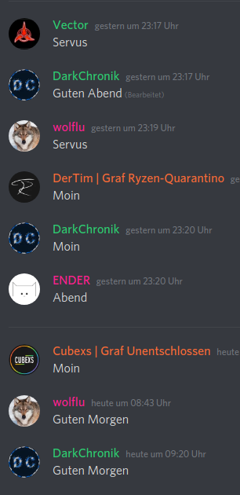
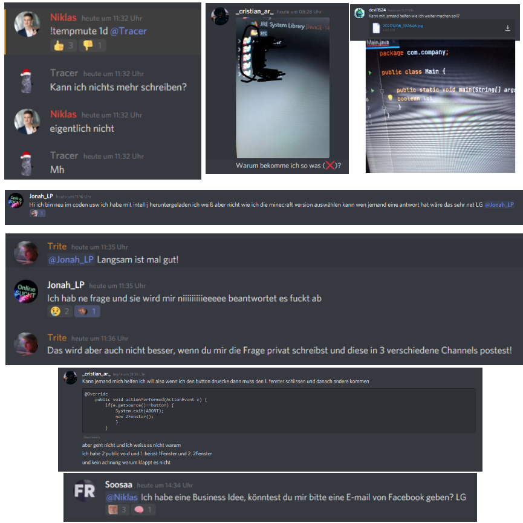
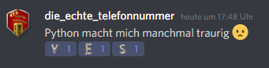
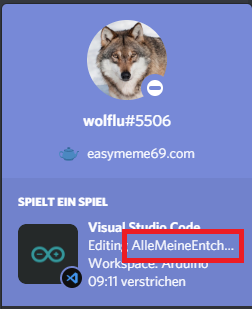
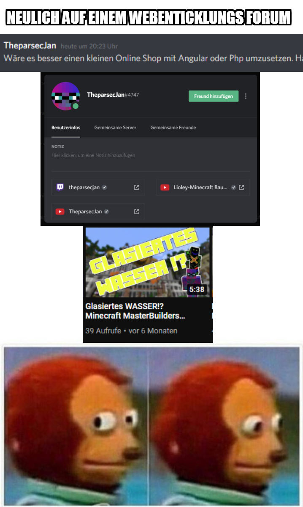
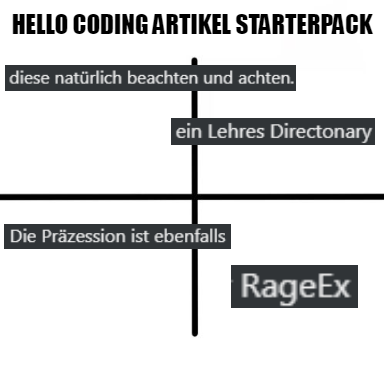
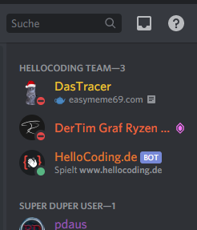
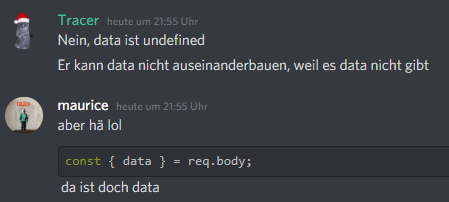
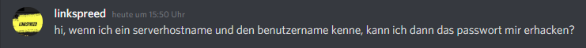
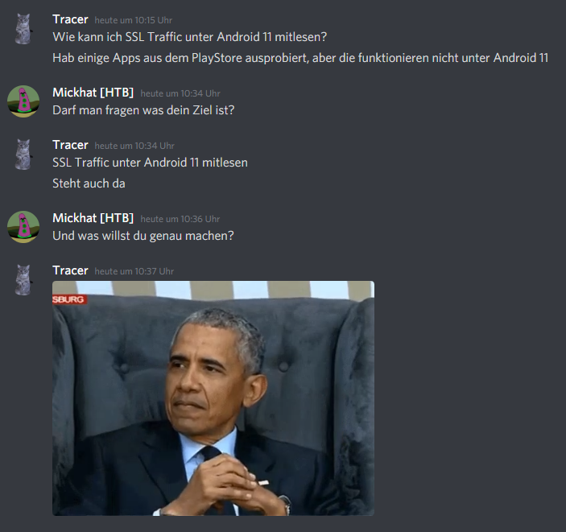

# Memes I found on Discord

### Guten Morgen Hello-Coding

### Best-Of Niklas Steenfatt Discord

### Python macht mich traurig

### Was macht wolflu hier? 🤔

### Experten-Meinung gefragt

### Hello-Coding Artikel Starterpack

*Bitte hau mich nicht Felix :(*

### Bis an die Spitze 🚀 👺

### Wo ist data?

### Passwort hacken leicht gemacht

### Was will er denn nun?

### Wieso gibt es Python?

